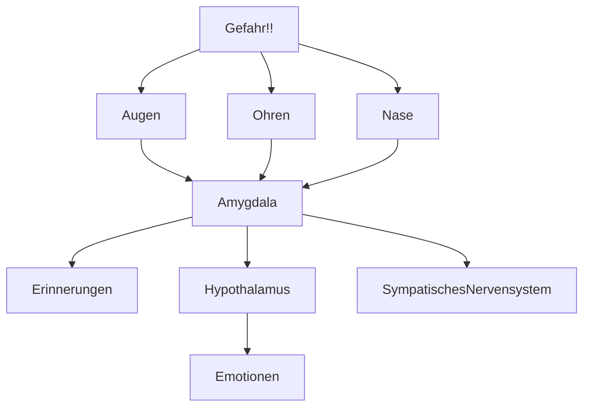

Quelle: [[stetka-2021]] Kap 10
Region des [[Gehirn]]s das [[Emotionen]] ([[Angst]],[[Stress]]) steuert.

```mermaid  
graph TD;  
Augen --> Amygdala;
Ohren --> Amygdala;
Nase --> Amygdala;
Gefahr!! --> Augen;
Gefahr!! --> Nase;
Gefahr!! --> Ohren;
Amygdala --> Erinnerungen;
Amygdala --> Hypothalamus;
Hypothalamus --> Emotionen;
Amygdala --> SympatischesNervensystem;
```
Verknüpft mit [[Hypothalamus]],[[Sympatisches Nervensystem]]

