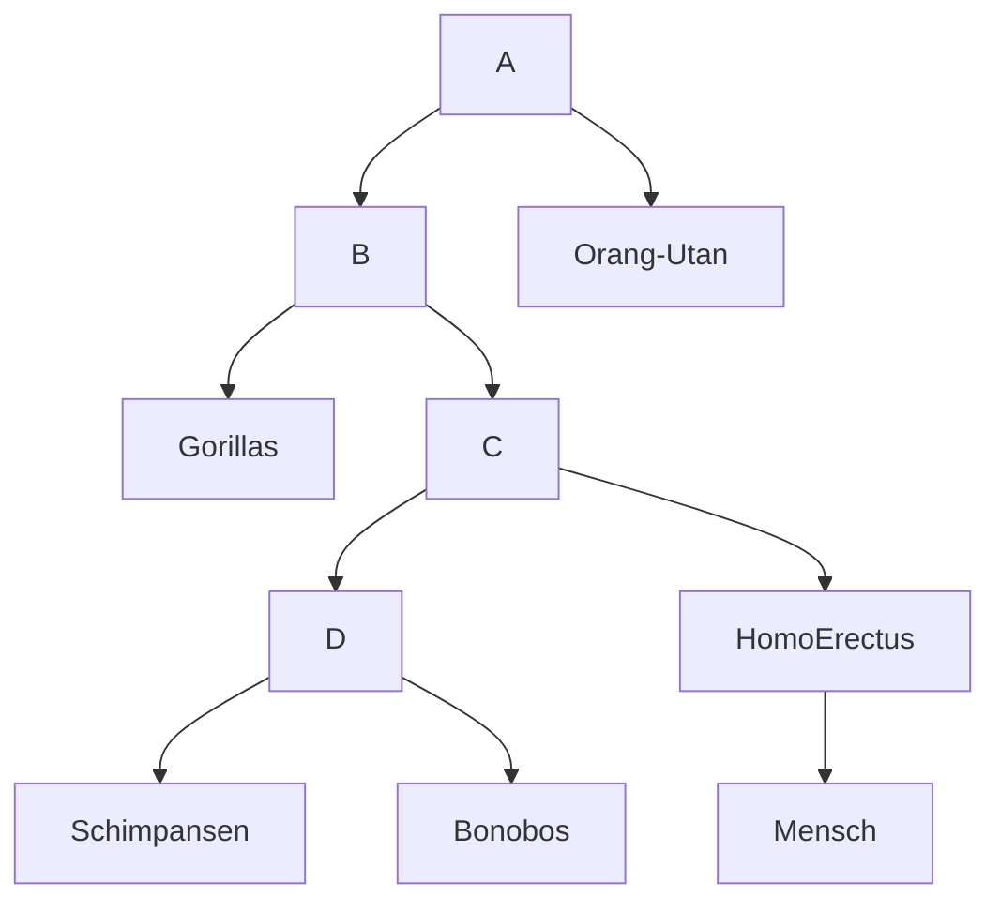

#  Stammbaum Mensch
2022-03-13 - 21:24
## Themen
#evolution [[Schimpansen]] [[Bonobos]] [[Gorillas]]
## Referenz
https://acrobat.adobe.com/link/review?uri=urn:aaid:scds:US:a0e151d8-a968-3f70-9feb-2775373b06e7
----

